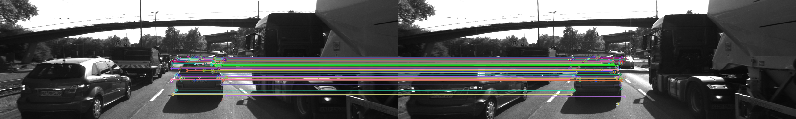

# 2D Feature Tracking for Collision Detection

A comprehensive implementation of keypoint detection, descriptor extraction, and feature matching for autonomous vehicle collision detection using OpenCV.

---

## Overview

This project implements a complete 2D feature tracking pipeline that:
- Detects keypoints on a preceding vehicle across 10 consecutive camera frames
- Extracts descriptors to uniquely identify detected features
- Matches keypoints between consecutive frames to track vehicle movement
- Logs detailed statistics for performance analysis

**Use Case**: Autonomous driving systems need to reliably detect and track preceding vehicles for collision avoidance. This system detects keypoints on the vehicle and tracks them across frames to monitor relative motion.



---

## Environment Setup

### Prerequisites

- **OS**: Linux (Ubuntu 20.04 LTS recommended)
- **Compiler**: GCC 9.0+ with C++17 support
- **CMake**: 3.10+
- **OpenCV**: 4.1+

### Installation

#### 1. Install System Dependencies

```bash
sudo apt-get update
sudo apt-get install -y \
    cmake \
    git \
    build-essential \
    pkg-config \
    libopencv-dev \
    libopencv-contrib-dev
```

#### 2. Clone Repository

```bash
git clone https://github.com/22by7-raikar/Camera_based_2D_Feature_Tracking
cd Camera_based_2D_Feature_Tracking
```

#### 3. Create Build Directory

```bash
mkdir build
cd build
```

#### 4. Build Project

```bash
cmake ..
make -j$(nproc)
```

#### 5. (Optional) Enable Full SIFT/BRIEF/FREAK Support

SIFT, BRIEF, and FREAK descriptors require `opencv-contrib`. Without it, the program throws a `std::runtime_error` at startup for those combinations. To enable them:

**Option A: Install opencv-contrib-python (Easiest)**
```bash
pip install opencv-contrib-python
```

**Option B: Build OpenCV from Source (Advanced)**
```bash
git clone https://github.com/opencv/opencv.git -b 4.2.0
git clone https://github.com/opencv/opencv_contrib.git -b 4.2.0
cd opencv && mkdir build && cd build
cmake -D OPENCV_EXTRA_MODULES_PATH=../opencv_contrib/modules ..
make -j$(nproc)
sudo make install
```

---

## Project Structure

```
2D-Feature-Tracking-Collision-Detection/
  CMakeLists.txt                   # Build configuration
  README.md                        # This file
  .gitignore                       # Git ignore rules
  src/
    matching2D.hpp                 # Function declarations
    matching2D.cpp                 # Detector & descriptor implementations
    main.cpp                       # Main program
    dataStructures.h               # Data structure definitions
  images/
    KITTI/2011_09_26/image_00/data/  # 10 test images (000000-000009.png)
  scripts/
    analyze.py                     # Performance analysis script
  build/                           # Build directory (generated, not tracked)
```

---

## Features Implemented

### Keypoint Detectors

Implementation of 7 detectors:

1. **SHITOMASI** - Traditional corner detection via goodFeaturesToTrack()
   - Fixed neighborhood size (4px)
   - Fast and reliable

2. **HARRIS** - Harris corner detection with non-maximum suppression
   - Minimum response threshold: 100
   - Fixed neighborhood size (6px)

3. **FAST** - Features from Accelerated Segment Test
   - Threshold: 30, with NMS (TYPE_9_16)
   - Very fast, good for real-time applications

4. **BRISK** - Binary Robust Invariant Scalable Keypoints
   - Threshold: 30, Octaves: 3
   - Scale and rotation invariant

5. **ORB** - Oriented FAST and Rotated BRIEF
   - 500 features, HARRIS scoring
   - Computationally efficient

6. **AKAZE** - Accelerated-KAZE
   - MLDB descriptor, 4 octaves
   - Good balance of speed and accuracy

7. **SIFT** - Scale-Invariant Feature Transform
   - Requires xfeatures2d; throws `std::runtime_error` if unavailable
   - Most distinctive feature descriptor

### Keypoint Descriptors

Implementation of 6 descriptors:

1. **BRISK** - Native binary descriptor
   - Threshold: 30, Octaves: 3
   - Hamming norm matching

2. **ORB** - Oriented BRIEF descriptor
   - 500 features, rotated binary patterns
   - Hamming norm matching

3. **AKAZE** - AKAZE descriptor
   - MLDB type, 32-byte descriptor
   - Hamming norm matching

4. **BRIEF** - Conditional support
   - Requires xfeatures2d; throws `std::runtime_error` if unavailable
   - Fast binary descriptor for feature points

5. **FREAK** - Conditional support
   - Requires xfeatures2d; throws `std::runtime_error` if unavailable
   - Fast Retina Keypoint with eye-inspired filtering

6. **SIFT** - Conditional support
   - Requires xfeatures2d; throws `std::runtime_error` if unavailable
   - Float descriptors with L2 norm matching

### Vehicle ROI Filtering
  - Bounding box: x=535, y=180, width=180, height=150 using `cv::Rect`
  - Filters keypoints to focus on preceding vehicle

### Descriptor Matching
  - Brute Force (BF) matcher with adaptive norm selection
    - L2 norm for SIFT (float descriptors)
    - Hamming norm for others (binary descriptors)
  - FLANN matcher alternative support

### Match Filtering
  - KNN selector with Lowe's ratio test
  - Distance ratio threshold: 0.8
  - Removes ambiguous matches

### Data Logging

Three types of output files are generated automatically:

1. **keypoint_log.csv**
   - ImageIndex, DetectorType, NumKeypoints, MinSize, MaxSize, MeanSize
   - Tracks keypoint statistics per detector per image

2. **match_log.csv**
   - ImageIndex, DetectorType, DescriptorType, NumMatches
   - Matches between consecutive frames

3. **Match Visualization Images** (PNG format)
   - Automatically saved to `images/outputs/match_DETECTOR_DESCRIPTOR_frames_N_M.png`
   - Shows detected keypoints and feature correspondences
   - One image per frame-pair per detector/descriptor combination
   - ~378 images generated for full run (42 combinations x 9 frame pairs)

## How to Run

### Basic Execution

```bash
cd build
./2D_feature_tracking
```

### What Happens

1. **Image Loading Phase**
   - Loads 10 KITTI dataset images (000000.png - 000009.png)
   - Converts to grayscale
   - Maintains ring buffer of 2 images

2. **Testing Phase**
   - For each of 7 detectors x 6 descriptors = 42 combinations:
     - Detects keypoints in current image
     - Filters keypoints to vehicle ROI
     - Extracts descriptors
     - Matches with keypoints from previous frame
     - Logs results

3. **Output Generation**
   - Console output with timing information
   - CSV data files for analysis

### Expected Runtime

- Total time: ~15-20 minutes (depending on hardware)
- Average per combination: ~20 seconds (10 images x match overhead)
- If xfeatures2d available: Additional SIFT/BRIEF/FREAK native implementations

---

## Output Analysis


### Generated Files

```bash
# From build directory, output files go to parent:
../keypoint_log.csv                    # 361 lines (header + statistics)
../match_log.csv                       # 361 lines (header + match data)
../images/outputs/match_*.png          # ~378 visualization images
```

The `images/outputs/` directory contains:
- **PNG files** showing detected keypoints and feature matches
- **CSV logs** with statistical data
- **Sample outputs** from execution runs
- **Performance analysis** report

### Example CSV Analysis

**Top performing combinations** (by match count):
```bash
# Run from the project root after executing the tracker
python3 scripts/analyze.py

# Show only top 5 combinations
python3 scripts/analyze.py --top 5

# Point to custom log files
python3 scripts/analyze.py --keypoints path/to/keypoint_log.csv --matches path/to/match_log.csv
```

Example output:
```
=== Keypoint counts per detector (avg over all images) ===
   1. BRISK       :   274.6 keypoints/image
   2. AKAZE       :   166.9 keypoints/image
   3. FAST        :   149.1 keypoints/image
   4. SHITOMASI   :   118.8 keypoints/image
   5. ORB         :   113.0 keypoints/image
   6. HARRIS      :    23.7 keypoints/image

=== Top 10 combinations by average match count ===
    #  Detector/Descriptor       Mean    Min    Max
  -------------------------------------------------
    1  BRISK/BRISK              174.4    157    188
    2  BRISK/ORB                167.8    154    180
    3  AKAZE/AKAZE              139.9    127    151
    4  AKAZE/BRISK              135.0    125    146
    5  AKAZE/ORB                131.8    115    146
    6  FAST/ORB                 120.1    107    129
    7  SHITOMASI/ORB            100.8     97    104
    8  FAST/BRISK                99.9     85    107
    9  SHITOMASI/BRISK           85.2     79     95
   10  ORB/ORB                   84.6     65    101
```

### Performance Recommendations

From `python3 scripts/analyze.py` output:
- **Most Reliable**: BRISK/BRISK (174.4 avg), BRISK/ORB (167.8 avg)
- **Fastest**: FAST/ORB, ORB/ORB (lowest keypoint-count overhead)
- **Best Balance**: AKAZE/AKAZE (139.9 avg matches, scale & rotation invariant)

---

## Implementation Notes

### Handling OpenCV Version Differences

The code uses conditional compilation to handle different OpenCV versions:

```cpp
#if HAS_XFEATURES2D
    // Use xfeatures2d for SIFT, BRIEF, FREAK
#else
    // Fall back to native implementations
#endif
```

### Descriptor Type Detection

Automatic matching normalization:
- **SIFT** detector/descriptor -> Uses L2 norm (float features)
- **All others** -> Use Hamming norm (binary features)

This ensures compatibility across different descriptor types.

### Keypoint Neighborhood Sizes

Different detectors use different keypoint representations:
- **Fixed size detectors**: SHITOMASI (4px), HARRIS (6px), FAST (7px)
- **Multi-scale detectors**: BRISK (72px), ORB (111px), AKAZE (23px)

Logged in keypoint_log.csv for analysis.


## Troubleshooting

### Build Issues

**Error**: `opencv2/xfeatures2d.hpp: No such file or directory`
- **Solution**: This is expected on systems without opencv-contrib
- Without `opencv-contrib`, the program throws `std::runtime_error` for SIFT/BRIEF/FREAK combinations

**Error**: `OpenCV version too old`
- **Requirement**: OpenCV 4.1+
- **Fix**: `sudo apt-get install --upgrade libopencv-dev`

### Runtime Issues

**Error**: `Assertion failed in cvtColor`
- **Cause**: Image files not found in expected location
- **Fix**: Run from `build/` directory: `./2D_feature_tracking`

**Error**: `Detector type not recognized`
- **Cause**: Typo in detector name
- **Fix**: Check against valid list: SHITOMASI, HARRIS, FAST, BRISK, ORB, AKAZE, SIFT

**No CSV files generated**
- **Cause**: Program may have crashed or didn't complete
- **Check**: Look for "Analysis Complete" message at end of output

---

## Performance Benchmarking

### System Specifications

Best run on:
- **CPU**: Intel i5+ or equivalent (multi-core for -j$(nproc))
- **RAM**: 4GB+ (2GB minimum)
- **Storage**: 500MB free space
- **OS**: Linux (Ubuntu 20.04 or newer)


### Profile Results

Example output per image:
```
Shi-Tomasi detection: 10 ms
BRISK descriptor: 1.5 ms
Matching: 2-5 ms per frame pair
Total per combination: ~20 seconds for 10 images
```

---

## Sample Outputs

### Example 1: SHITOMASI + BRISK (Reliable Detector)

A classic combination showing consistent performance across frames:

```
Testing: SHITOMASI + BRISK
========================================
SHITOMASI detection with n=125 keypoints in ~10ms
Image 0 - SHITOMASI: 125 keypoints (Size - Min: 4, Max: 4, Mean: 4)
BRISK descriptor extraction in ~3ms

Image 1 - SHITOMASI/BRISK: 95 matches
Image 2 - SHITOMASI/BRISK: 88 matches
Image 3 - SHITOMASI/BRISK: 80 matches
Image 4 - SHITOMASI/BRISK: 90 matches
Image 5 - SHITOMASI/BRISK: 82 matches
Image 6 - SHITOMASI/BRISK: 79 matches
Image 7 - SHITOMASI/BRISK: 85 matches
Image 8 - SHITOMASI/BRISK: 86 matches
Image 9 - SHITOMASI/BRISK: 82 matches

Average matches: 85.2
```

**Full execution log**: [sample_output_SHITOMASI_BRISK.txt](images/outputs/sample_output_SHITOMASI_BRISK.txt)

### Example 2: FAST + ORB (Fastest Combination)

Real-time capable combination with excellent speed:

```
Testing: FAST + ORB
========================================
FAST detection with n=149 keypoints in ~4ms
Image 0 - FAST: 149 keypoints (Size - Min: 7, Max: 7, Mean: 7)
ORB descriptor extraction in ~2ms

Image 1 - FAST/ORB: 122 matches
Image 2 - FAST/ORB: 122 matches
Image 3 - FAST/ORB: 115 matches
Image 4 - FAST/ORB: 129 matches
Image 5 - FAST/ORB: 107 matches
Image 6 - FAST/ORB: 120 matches
Image 7 - FAST/ORB: 126 matches
Image 8 - FAST/ORB: 122 matches
Image 9 - FAST/ORB: 118 matches

Average matches: 120.1
```

**Full execution log**: [sample_output_FAST_ORB.txt](images/outputs/sample_output_FAST_ORB.txt)

### CSV Data Samples

**Sample Keypoint Statistics** (from keypoint_log.csv):

| ImageIndex | DetectorType | NumKeypoints | MinSize | MaxSize | MeanSize |
|------------|--------------|--------------|---------|---------|----------|
| 0 | SHITOMASI | 125 | 4.00 | 4.00 | 4.00 |
| 0 | HARRIS | 17 | 6.00 | 6.00 | 6.00 |
| 0 | FAST | 149 | 7.00 | 7.00 | 7.00 |
| 0 | BRISK | 264 | 8.40 | 72.00 | 21.55 |
| 0 | ORB | 92 | 31.00 | 111.08 | 57.07 |
| 0 | AKAZE | 166 | 4.80 | 27.15 | 7.73 |

[Full sample file](images/outputs/sample_keypoint_statistics.csv)

**Sample Match Statistics** (from match_log.csv):

| ImageIndex | DetectorType | DescriptorType | NumMatches |
|------------|--------------|----------------|------------|
| 1 | BRISK | BRISK | 171 |
| 1 | FAST | ORB | 122 |
| 1 | AKAZE | AKAZE | 138 |
| 1 | SHITOMASI | ORB | 104 |
| 1 | HARRIS | ORB | 12 |

[Full sample file](images/outputs/sample_match_statistics.csv)

### Match Visualization Images

The program automatically generates **match visualization images** showing detected keypoints and their correspondences between consecutive frames. These are saved to `images/outputs/` with filenames like:

```
match_DETECTOR_DESCRIPTOR_frames_N_N+1.png
```

**Example images generated** (from first test run):

- `match_SHITOMASI_BRISK_frames_0_1.png` - Frame 0->1 with SHITOMASI/BRISK
- `match_SHITOMASI_BRISK_frames_1_2.png` - Frame 1->2 with SHITOMASI/BRISK
- `match_SHITOMASI_ORB_frames_0_1.png` - Frame 0->1 with SHITOMASI/ORB
- ... and so on

**When you run the full program** (42 combinations x 9 frame pairs):
- **~378 match visualization PNG images** will be generated
- Each image shows the two consecutive frames side-by-side
- Detected keypoints marked with circles
- Matching points connected with lines (green = good matches)
- Red = unmatched keypoints

**Total output files after full run:**
```
images/outputs/
  keypoint_log.csv              # Detector statistics
  match_log.csv                 # Match counts
  match_*.png                   # ~378 visualization images
  sample_*.txt                  # Example outputs
  sample_*.csv                  # Example data
  performance_analysis.txt      # Performance report
```

### Performance Summary

For a comprehensive overview of all detector/descriptor combinations and their performance characteristics, see:

[**Performance Analysis Report**](images/outputs/performance_analysis.txt)

This includes:
- Top 10 combinations ranked by match consistency
- Fastest combinations with timing breakdown
- Detector characteristics (keypoint size, count, properties)
- Descriptor quality metrics
- Use-case specific recommendations
- Complete performance benchmarks

---

## License & Attribution

- **Dataset**: KITTI Vision Benchmark Suite
- **OpenCV**: BSD License

---

## References

1. Harris Corner Detection: C. Harris and M. Stephens (1988)
2. FAST: E. Rosten and T. Drummond (2006)
3. BRISK: S. Leutenegger et al. (2011)
4. ORB: E. Rublee et al. (2011)
5. AKAZE: P. F. Alcantarilla et al. (2013)
6. SIFT: D. Lowe (2004)
7. OpenCV Documentation: https://docs.opencv.org/
